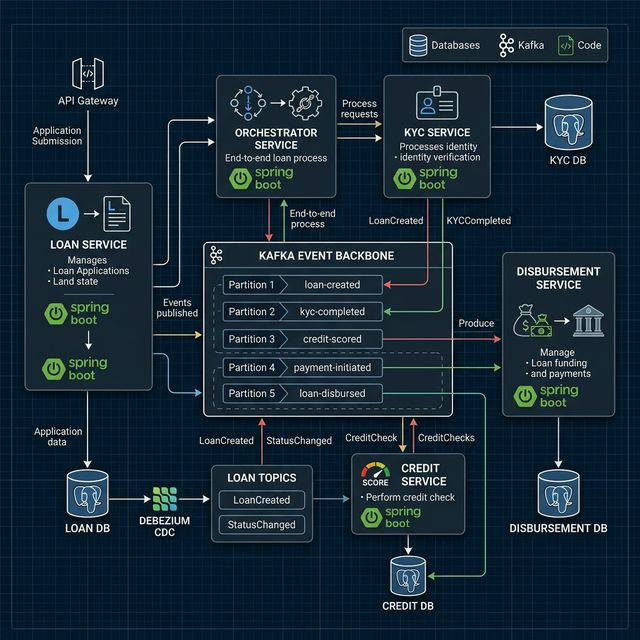
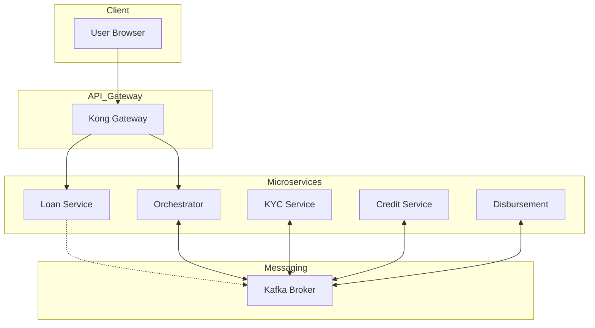

# Level 2: Container Diagram

```mermaid
flowchart TD
    subgraph Client
        Browser[User Browser]
    end

    subgraph API_Gateway
        Kong[Kong Gateway]
    end

    subgraph Microservices
        LoanService[Loan Service]
        Orchestrator[Orchestrator]
        KYCService[KYC Service]
        CreditService[Credit Service]
        Disbursement[Disbursement]
    end

    subgraph Messaging
        Kafka[Kafka Broker]
    end

    Browser --> Kong
    Kong --> LoanService
    Kong --> Orchestrator
    LoanService -.-> Kafka
    Orchestrator <--> Kafka
    KYCService <--> Kafka
    CreditService <--> Kafka
    Disbursement <--> Kafka
```
