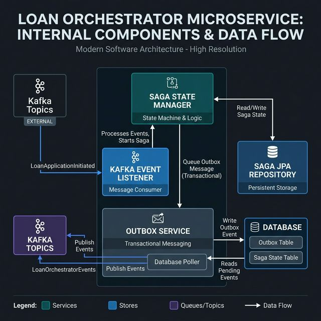
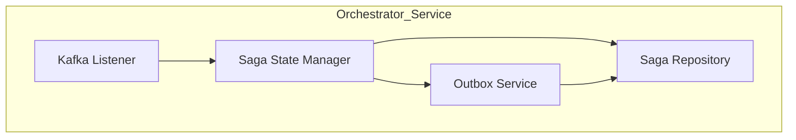

# Level 3: Component Diagram (Orchestrator)

```mermaid
flowchart TB
    subgraph Orchestrator_Service
        Manager[Saga State Manager]
        Listener[Kafka Listener]
        Outbox[Outbox Service]
        Repo[Saga Repository]
    end

    Listener --> Manager
    Manager --> Repo
    Manager --> Outbox
    Outbox --> Repo
```
